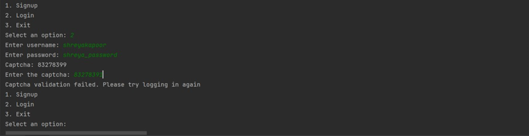
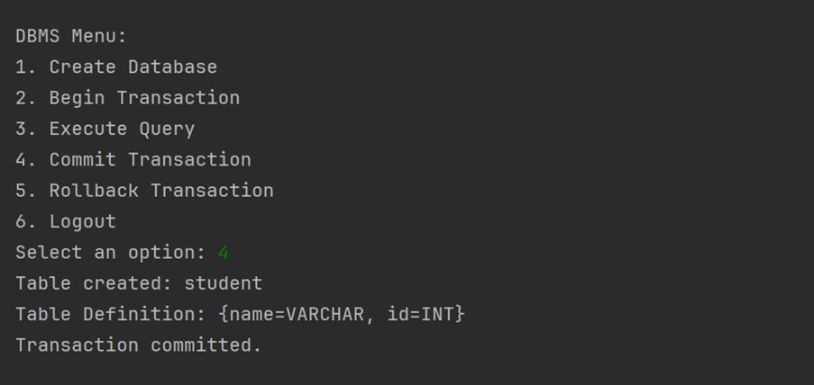
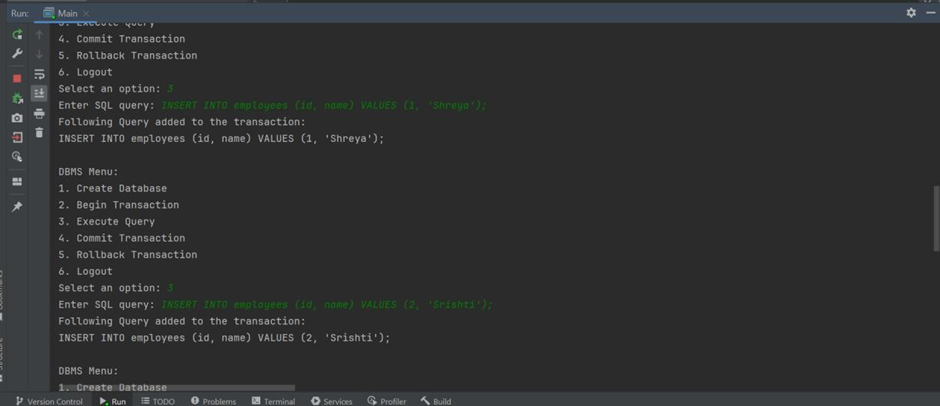
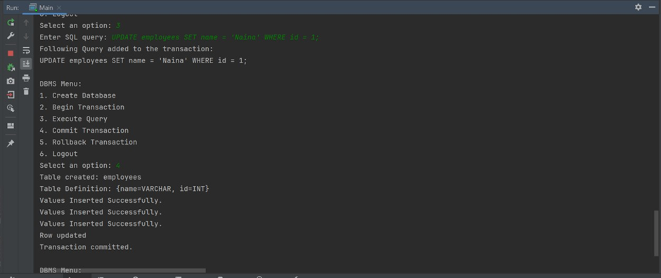
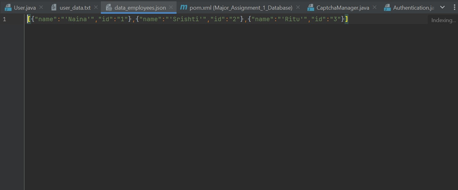
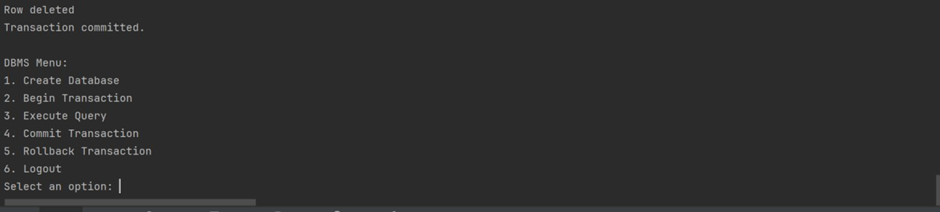

# JDBase
It is a lightweight Java-based database management system (DBMS) offering authentication, efficient data storage, Data Definition Language (DDL), Data Manipulation Language (DML), and transaction support. It provides a compact yet comprehensive solution for secure data management in resource-constrained environments.

## Task Design 
Design Principles that I have in my application of creating the custom DB are as follows: 

1. **Single Responsibility Principle**:
The Single Responsibility Principle (SRP) states that a class should have only one reason to change, meaning it should have only one responsibility or function. In my application, I have organized the classes and methods well to adhere to the SRP. 
    - **Authentication.java**: This class is responsible for user authentication.  
It handles user sign-up, hashing passwords, and authenticating users. It maintains a collection of users and manages user data. 
 
    - **DatabaseManager.java**: This class manages the shared database. 
It encapsulates the responsibility of database creation and management. It provides a single point of access to the shared database. 
 
    - **Database.java**: 
This class handles database operations like creating tables, inserting data, updating data, and deleting data. 
It also manages the database structure and data storage. It maintains a collection of tables and their data. 
 
    - **QueryExecutor.java**:
This class is responsible for executing SQL queries on the database. It delegates query execution to specialized query executor classes. 
 
2. **Encapsulation** 
Encapsulation refers to the concept of bundling data (attributes) and the methods 
(functions) that operate on that data into a single unit known as a class [4]. In my application encapsulation is evident in the way classes encapsulate their internal data and provide controlled access to it through methods. 
 
    - **Authentication.java**:
The Authentication class encapsulates user data by storing it in a collection and controlling access to it through methods like addUser, getUser, and authenticateUser. It encapsulates the hashing of passwords within the hashPassword method, hiding the implementation details from external code. 
 
    - **Database.java**: 
The Database class encapsulates database-related operations and data storage. It maintains a private map of tables, encapsulating the internal data structure. Access to this internal data structure is controlled through public methods like createTable, insertData, selectData, etc. 
 
    - **DatabaseManager.java**: 
The DatabaseManager class encapsulates the shared database instance and provides controlled access through the getSharedDatabase method. It hides the implementation details of database management from external code. 
 
    - **QueryExecutor.java**: 
The QueryExecutor class encapsulates the execution of SQL queries and delegates query execution to specialized query executor classes. It encapsulates the details of query execution, isolating query-specific logic. 
 
3. **Modularity**: 
Modularity is a design principle that involves breaking down a complex system into smaller, self-contained, and reusable modules or components. I made sure while developing the application that my application is as modular as possible to increase the readability and understandability of the classes. 
 
    - **Authentication.java**: 
The Authentication class is responsible for user management and authentication, encapsulating all related functionality. It provides a modular way to handle user-related tasks, making it easier to maintain and extend this component independently. 
 
    - **Database.java**: 
The Database class serves as a module for database management, data storage, and table handling. It encapsulates all the database-related operations, providing a modular and selfcontained solution. 
 
    - **DatabaseManager.java**: 
The DatabaseManager class acts as a modular component for managing the shared database instance. It abstracts the details of database management and provides a well-defined interface for obtaining the database instance. 
 
    - **QueryExecutor.java**: 
The QueryExecutor class coordinates query execution but delegates query-specific logic to specialized query executor classes. This modular approach allows you to extend the system by adding new query types independently. 
 
4. **Separation of Concerns (SoC)**: 
It is a design principle that encourages breaking a complex system into distinct and welldefined modules or components, where each module focuses on a specific concern or responsibility. In my application, I have organised different packages, each addressing a specific concern. 

 
    - **Authentication Package**:  
This package is responsible for user authentication and management. The Authentication class and related classes within this package handle all aspects of user authentication, encapsulating this specific concern. 
 
    - **Database Management Package**:  
This package focuses on database management and data storage. The Database and DatabaseManager classes are key components within this package, concentrating on database-related concerns. 
 
    - **Query Execution Package**: 
This package is dedicated to query execution and management. Classes like QueryExecutor, SelectQueryExecutor, InsertQueryExecutor, etc., are found here and deal with query-related concerns. 

## Application Demo of Authentication

Before running the application, I have an empty user_data.txt file present in my application. 

Here, I selected option 1 and got prompted to input the username and password to signup. After setting it up, I got the message “User registration successful”. 

After the signup, the username along with the hashed password is stored in this file. 

**TEST CASE 1**: 
Let me test the application, when the user enters the wrong captcha while logging in. 

**TEST CASE 2**: 
Let me now input some wrong password in my application while logging in. 

**TEST CASE 3**: 
Now, let’s enter the correct username and password and see what happens. 

## **Data Files**:
In my application, I have implemented the persistent storage using a file-based approach. I have chosen JSON as the storage format due to its simplicity and human-readable structure. It allows data to be easily organized into key-value pairs. 

-   **Storing Database Data**: 
I have implemented a custom database within the application. The database, represented as a collection of tables, stores data related to tables, columns, and rows. Each table's data is stored in a separate JSON file with a naming convention like "data_tableName.json" The Database class handles creating and managing these data files. It includes methods to load and save data to these files. 

-   **User Information**: 
As elaborated in the Authentication process, the user information, such as usernames and hashed passwords, is stored in a user data file. User data is saved in a structured format, making it accessible and manageable. 

## Demonstration of Queries within transaction environment

**TESTCASE 1**: 
Creation of database in my application. 

Once I selected the create Database option, it shows Database created. 

**Observation**: As seen, in my application a new file data.json is been created. 

**TESTCASE 2**: 
Now that we already have the database created. 

**Observation**: When I selected option 1 again, it showed me output stating Database Already Exist. 

**TESTCASE 3**: 
Starting the transaction 

**Observation**: When the user selects the second option, it says transaction started. 

**TESTCASE 4**: 
Creating a student table 

**Observation**: As illustrated above, when the user creates a table, commits the transaction, a new table is created and the schema details of the table is stored in data.json. 

**TESTCASE 5**: 
Inserting values in the table 

**Observation**: As shown, data_student.json file has been created where the values are inserted. 

**TESTCASE 6**: 
Updating the value in the table 

To showcase the update in a transaction environment, I have created a new table employees with fields name and INT and then inserted 3 values in it. And then updated the name field where id = 1 

**Observation**: It is evident that the query ran correctly and the name field is updated to Naina where id was 1. 

**TESTCASE 7**: 
Deleting the value from table 

**Observation**: As shown here, we executed the query to delete the row where id = 1, and now in the updated data_employees.json file, the entry with id = 1 has been removed. 

**TESTCASE 8**: 
Testing the rollback functionality. 

**Observation**: As seen, I have created the patients table and inserted values within it, but because I have not committed the transaction, the data is not stored in my database. When, I clicked on the rollback transaction option, all my queries which were present in the data structure (linked list) has been rolled back and the inserted data has been emptied out. 

